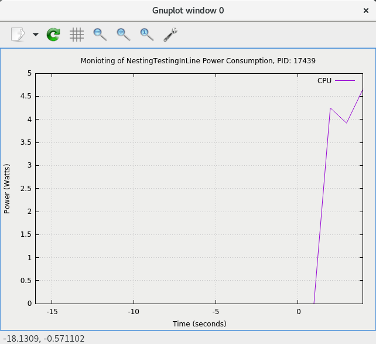

# Requirements
-java (tested on version 8)

-maven (tested on version 3)

-[feedGnuplot](http://search.cpan.org/~dkogan/feedgnuplot-1.42/bin/feedgnuplot)

# Platform's set-up
Before testing any applications execute the script Disable_P_State if the systems kernel version is higher than 3.10 (use uname -r to find it)

# General Information
This directory contains a number of scripts that will execute an applications and on the site will retrieve energy/power measurements.

The whole process is automated for the users, however, a user has to define as a command line arguments its application's paramenters.

# How to Execute
Get more information about command line arguments through the -h or -help command:

	$./script.[jolinar, jalen, PowerAPI, RAPL] -h, -help, --h, or --help

# Optional Information
It is suggested for the user to store the log files and results (command line argument --logs) in the results directory found under the SEMTs_Comparisson repository.

# Results Illustration
An additional feature that wrappers these script is the real-time plotingt of graphs--is done with the use of feedGnuplot--and the resource usage files which are 
stored in the log files of each tool (results/ToolName)

<table class="image">
<tr><td> </td></tr>
<tr><td class="caption">Single task execution</td></tr>
</table>
<table class="image">
<tr><td> </td></tr>
<tr><td class="caption">Comparing tasks execution</td></tr>
</table>

